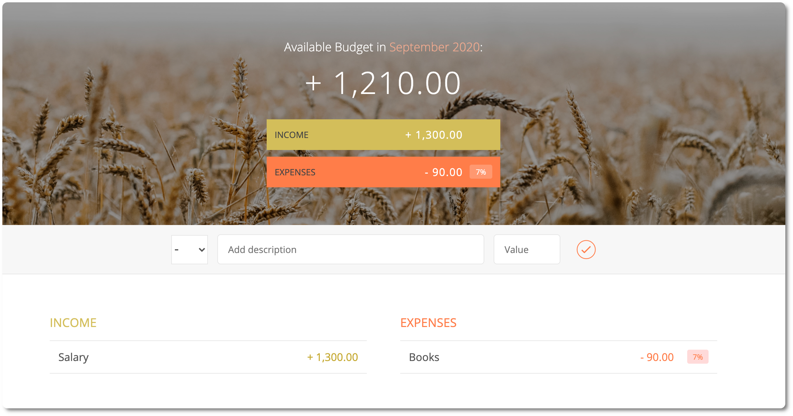

  
#  💸 Budget app

This is an app that allows the user to **keep track of expenses and income**. It is built entirely with JavaScript. The purpose was to build a JavaScript-only application that used JS modules and data encapsulation.

 

## 🌲 Structure

This app consists of 3 JS modules:

- `budgetController` module, which takes care of handling the data: adding new items to the data structure, calculating the budget.
- `UIController` module, which takes care of the UI: getting input values, adding new items to the UI and updating the UI.
- `controller` module, which links both `budgetController` and `UIcontroller`: it controls what happens upon each event and delegates tasks to other controllers.

 

## ☑️ Features

1. It displays the current month and year and the budget available for that month.
2. It displays the total income and the total expenses.
3. It allows the user to enter new items (either expense / income) with a description and a value.
4. The app displays each item in the right section (Income / Expenses)
5. The user can manually delete any item.
6. A percentage of the expenses based on the total income is available both for the total expenses and each expense item.

 

## 📓 Development diary

1. [Planning the app](https://github.com/elemarmar/budget-app/blob/master/doc/01-Planning%20of%20the%20app.md)
2. [First steps](https://github.com/elemarmar/budget-app/blob/master/doc/02-First%20steps.md)
3. [Updating the controller and the UI](https://github.com/elemarmar/budget-app/blob/master/doc/03-Updating%20the%20controller%20and%20UI.md)
4. [Deleting items](https://github.com/elemarmar/budget-app/blob/master/doc/04-Deleting%20items.md)
5. [Updating percentages](https://github.com/elemarmar/budget-app/blob/master/doc/05-Update%20percentages.md)
6. [Displaying date](https://github.com/elemarmar/budget-app/blob/master/doc/06-Display%20date.md)

 

## Thanks 
This project is based on [Jonas Schmedtmann](https://github.com/jonasschmedtmann) budgety project.
